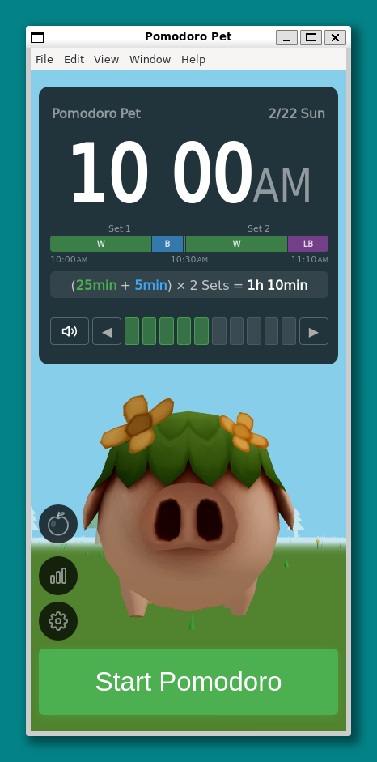
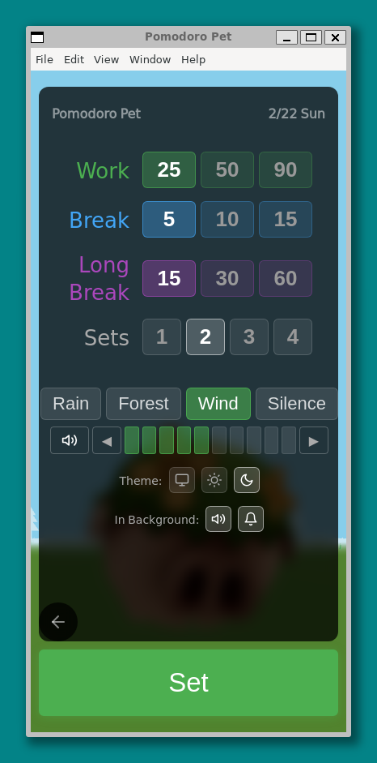
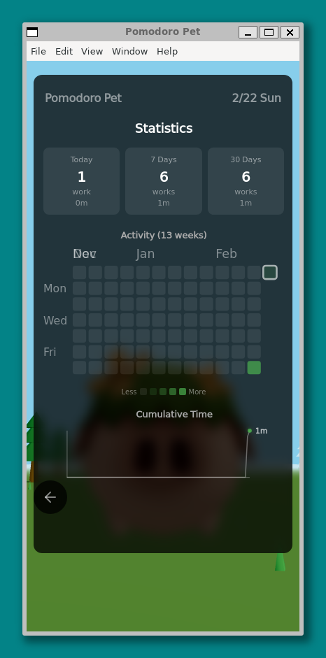
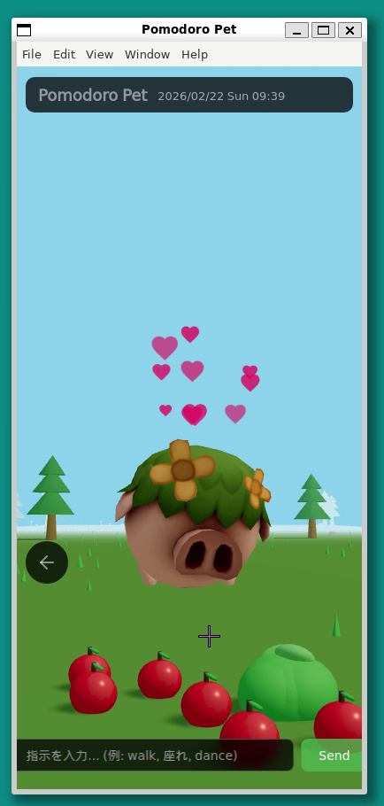
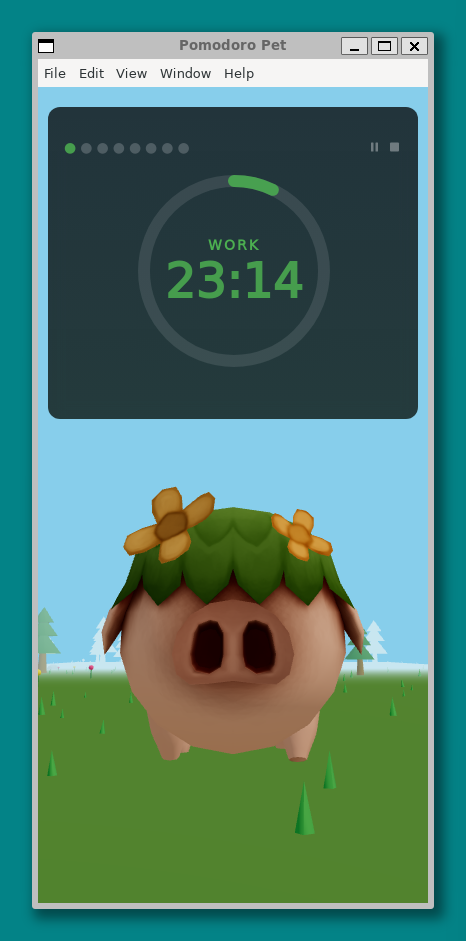
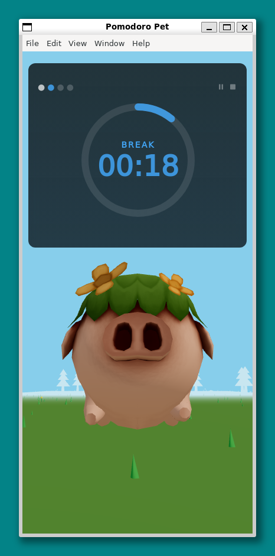

pomodoro-pet v0.1.0
==========

A 3D virtual pet pomodoro timer desktop app, aiming for Steam release.

> 🤖 This project is built entirely through **Vibe Coding** with [Claude Code](https://docs.anthropic.com/en/docs/claude-code) (Anthropic CLI).

## Screenshots

| Home | Config |
|:---:|:---:|
|  |  |

| Statistics | Pet (Fureai Mode) |
|:---:|:---:|
|  |  |

| Pomodoro | Break |
|:---:|:---:|
|  |  |

| Congrats |
|:---:|
|  |

## Features

- **Pomodoro Timer** — Work / Break / Long Break phase cycling with pause, resume, and stop. Circular progress ring, phase dots, and background tint visualization
- **Timer Settings** — Configurable Work / Break / Long Break durations and Sets per Cycle
- **3D Character** — Autonomous behavior (idle, wander, sit, sleep), march during work, celebration on completion. Click, pet, and drag interactions
- **Statistics** — 13-week heatmap, daily / 7-day / monthly summaries of completed cycles and work time
- **Fureai Mode** — Feed the character by dragging apples and cabbages. Prompt input for behavior commands (English / Japanese keywords)
- **Weather Settings** — Choose weather type (sunny / cloudy / rainy / snowy), cloud density (6 levels), and time of day (morning / day / evening / night / auto). Live preview with dynamic lighting and effects
- **Sound** — Procedural ambient sounds (forest / rain / wind), timer SFX, break BGM with crossfade, volume and mute controls
- **Background Notifications** — System toast notifications for phase completion and cycle completion when the app is in the background
- **Emotion System** — Satisfaction, fatigue, and affinity parameters that respond to pomodoro completion, feeding, and petting. Affinity persists across sessions
- **Auto Update** — Check, download, and install updates via electron-updater with in-app notification banner

## Architecture

Clean Architecture (dependency direction: outer → inner only)

```
domain ← application ← adapters ← infrastructure
```

Three domain contexts: Timer, Character, Environment.
Modules communicate via EventBus (Pub/Sub) for loose coupling.

## Tech Stack

TypeScript + Electron + Three.js + React + Vite + vanilla-extract

## Assets

- https://downraindc3d.itch.io/wildboar