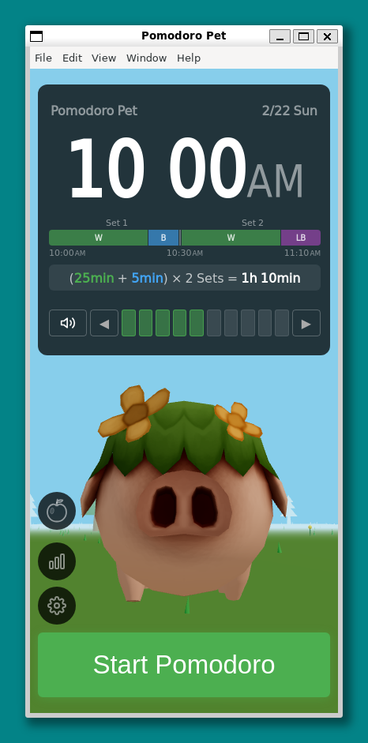
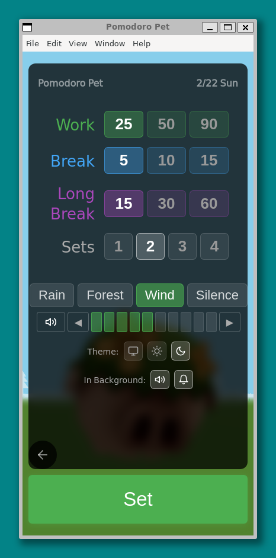
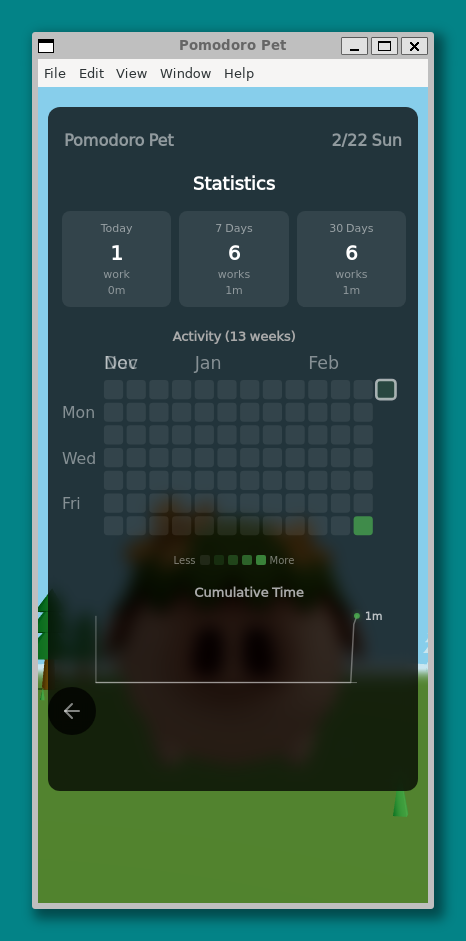
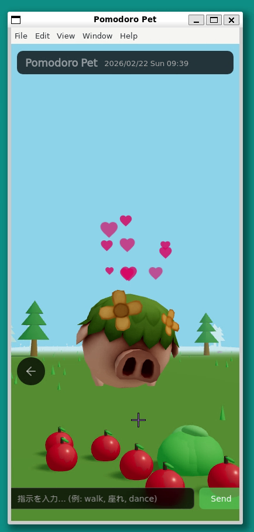
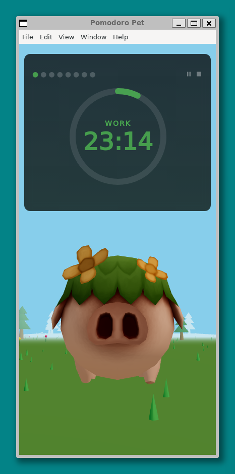
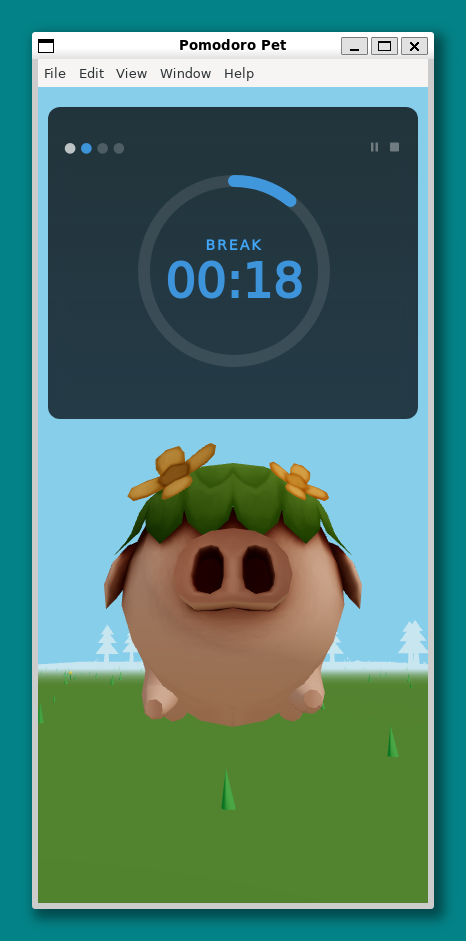
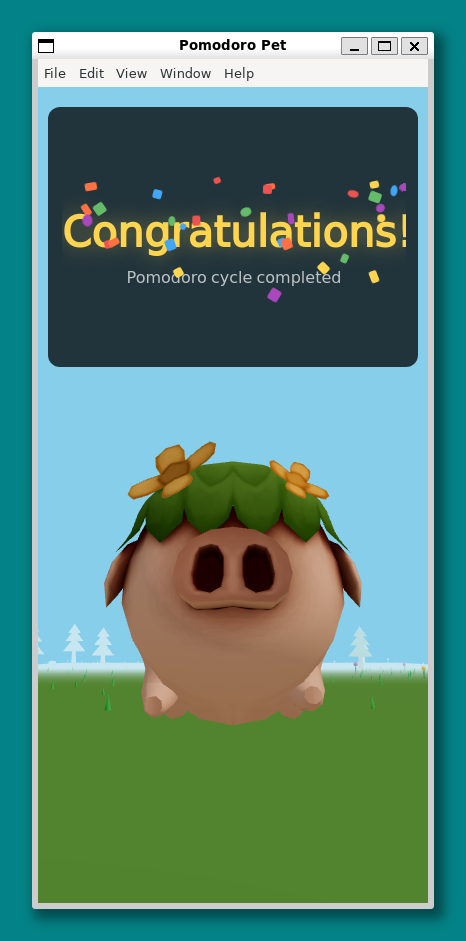

pomodoro-pet v0.13.1
==========

A 3D virtual pet pomodoro timer desktop app, aiming for Steam release.

> 🤖 This project is built entirely through **Vibe Coding** with [Claude Code](https://docs.anthropic.com/en/docs/claude-code) (Anthropic CLI).

## Screenshots

| Home | Config |
|:---:|:---:|
|  |  |

| Statistics | Pet (Fureai Mode) |
|:---:|:---:|
|  |  |

| Pomodoro | Break |
|:---:|:---:|
|  |  |

| Congrats |
|:---:|
|  |

## Features

- **Pomodoro Timer** — Work / Break / Long Break phase cycling with pause, resume, and stop. Circular progress ring, phase dots, and background tint visualization
- **Timer Settings** — Configurable Work / Break / Long Break durations and Sets per Cycle
- **3D Character** — Autonomous behavior (idle, wander, sit, sleep), march during work, celebration on completion. Click, pet, and drag interactions
- **Statistics** — 13-week heatmap, daily / 7-day / monthly summaries of completed cycles and work time
- **Fureai Mode** — Feed the character by dragging apples and cabbages. Prompt input for behavior commands (English / Japanese keywords)
- **Weather Settings** — Choose scene preset (meadow / seaside / park), weather type (sunny / cloudy / rainy / snowy), cloud density (6 levels), and time of day (morning / day / evening / night / auto). Live preview with dynamic lighting and effects. Scene-linked ambient sounds (meadow→forest, seaside→wind, park→forest)
- **Astronomy-based Environment** — Real-time sun/moon position calculation via astronomy-engine. Continuous sky color, exposure, and lighting direction derived from celestial altitude/azimuth. Twilight sun/moon crossfade. 3D moon object with phase texture (waxing/waning terminator) and glow effect, horizon fade, and weather-based opacity. Enhanced moonlight: full moon nights are visibly brighter (boosted exposure, ambient, and ground color moonlight blend). Weather auto-determination from climate data with precipitation-linked particle counts (rain 100-1200, snow 100-900)
- **72 Microseasons (Shichijuni-kou)** — Japanese traditional 72 microseasons resolved from solar ecliptic longitude. Overlay display with fade animation on season change
- **World Map Location Selector** — SVG equirectangular world map with day/night terminator. 8 city presets (Sydney / Tokyo / London / New York / Hawaii / Dubai / Reykjavik / Ushuaia) plus click-to-select custom coordinates. Timezone auto-resolved from coordinates (via tz-lookup) with pre-generated abbreviation mapping (386 entries). Free mode clock and timeline display local time with timezone label (JST, EST, AEDT, etc.)
- **Sound** — Procedural ambient sounds (forest / rain / wind), timer SFX, break BGM with crossfade, volume and mute controls
- **Background Notifications** — System toast notifications for phase completion and cycle completion when the app is in the background
- **Emotion System** — Satisfaction, fatigue, and affinity parameters that respond to pomodoro completion, feeding, and petting. All parameters persist across sessions with daily snapshots, event history tracking, and cross-session time-based changes (boredom decay, rest recovery, streak bonuses). Visual indicators (♥ ⚡ ★) in the fureai panel show current emotion state via opacity. Emotion trend chart in the Statistics panel displays 3-line graphs (satisfaction/fatigue/affinity) with period switching (7d/30d/All) and pomodoro completion event bars
- **Biorhythm** — Daily periodic state variation (activity 5-day / sociability 7-day / focus 11-day sine wave cycles) that affects character behavior duration, idle animations, and march speed. Feeding and petting provide temporary boosts. Neon-colored sine curve graph with animated dots in the Statistics panel (registered license only)
- **Sleep Prevention** — Prevents OS sleep/suspend during pomodoro sessions using Electron's powerSaveBlocker API. Configurable ON/OFF toggle (default ON)
- **Data Export / Import** (registered license only) — Export settings, statistics, and emotion history to a local JSON backup file for PC migration or backup. Import with version compatibility validation, confirmation dialog, and automatic app restart. License credentials (deviceId / downloadKey / JWT) are preserved during import
- **Auto Update** — Check, download, and install updates via electron-updater with in-app notification banner

## Architecture

Clean Architecture (dependency direction: outer → inner only)

```
domain ← application ← adapters ← infrastructure
```

Three domain contexts: Timer, Character, Environment.
Modules communicate via EventBus (Pub/Sub) for loose coupling.

## Tech Stack

TypeScript + Electron + Three.js + React + Vite + vanilla-extract

## Assets

This project is made possible by the following amazing creators and services. Thank you!

### 3D Model
- **Wildboar** by [downraindc3d](https://downraindc3d.itch.io/wildboar) — 3D character model and animations (itch.io)

### Music & Sound Effects
- BGM and sound effects from [ElevenLabs](https://elevenlabs.io/) — Break BGM, timer SFX, fanfare
- Procedural ambient sounds (forest, rain, wind) are generated in-app

## License

This project is **Source Available** (not open source).

Source code is licensed under [PolyForm Noncommercial License 1.0.0](https://polyformproject.org/licenses/noncommercial/1.0.0/) — See [LICENSE](./LICENSE)

Copyright 2026 sato1043@updater.cc